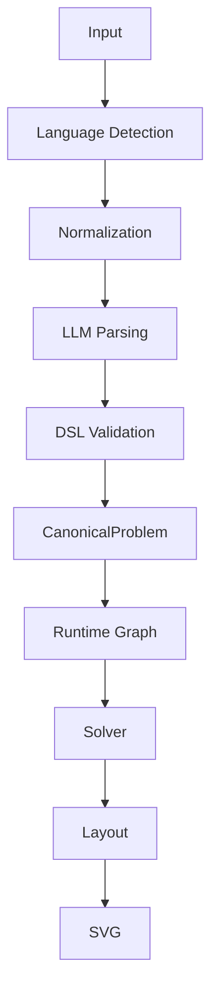
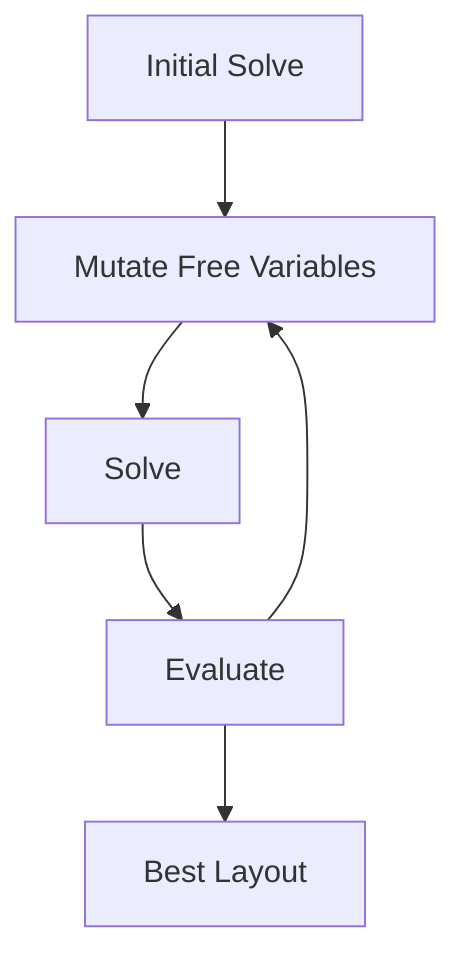

# Diagrams (Mermaid)

## Pipeline

```mermaid
graph TD
A[Input] --> B[Language Detection]
B --> C[Normalization]
C --> D[LLM Parsing]
D --> E[DSL Validation]
E --> F[CanonicalProblem]
F --> G[Runtime Graph]
G --> H[Solver]
H --> I[Layout]
I --> J[SVG]
```

## Solver vs Layout Loop

```mermaid
graph TD
A[Initial Solve] --> B[Mutate Free Variables]
B --> C[Solve]
C --> D[Evaluate]
D --> B
D --> E[Best Layout]
```
